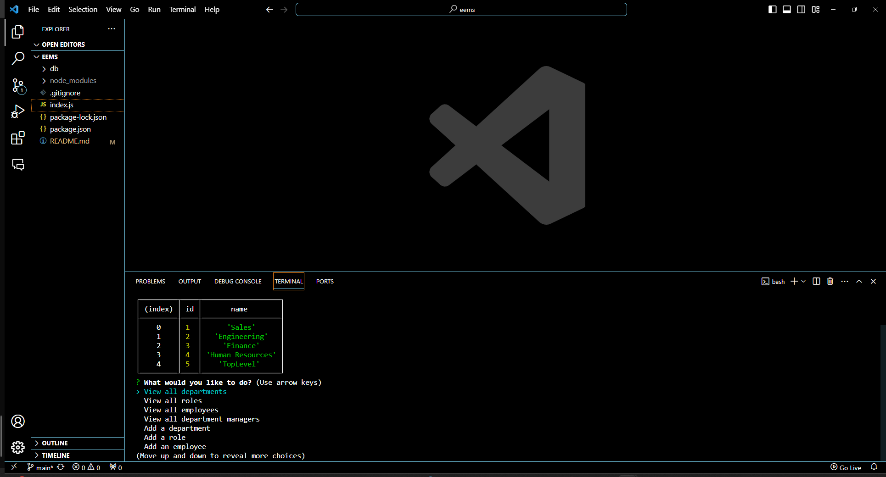

  # EEMS
  
  ## Description
  Electonic Employee Management System is a command-line application that accepts user input and gives business owners the ability to easily manage their businesses.
  
  ## Table of Contents
  - [Installation](#installation)
  - [Usage](#usage)
  - [License](#license)
  - [Contributing](#contributing)
  - [Tests](#tests)
  - [Questions](#questions)
  
  ## Installation
  they can clone the repo
  
  ## Usage
  from the command line, users will run the npm install, and then node index.js to start
  
  ## License
  This project is licensed under the MIT license.
  
  ## Contributing
  all donations are welcome
  
  ## Tests
  no testing necessary
  
  ## Questions
  - GitHub: [scsc22](https://github.com/scsc22)
  - Email: seanconnor22@gmail.com
  